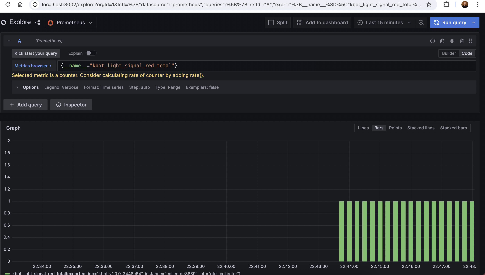

# Open-telemetry observability

Sample configuration for Kbot that send logs to [OpenTelemetry Collector] and metrics to [OpenTelemetry Collector] or [Prometheus].

## Prerequisites

- [Docker]
- [Docker Compose]

## How to run

```bash
export TELE_TOKEN=<TOKEN>
docker-compose up
```
Send messages to the bot and check Grafana (locally) on port 3002

